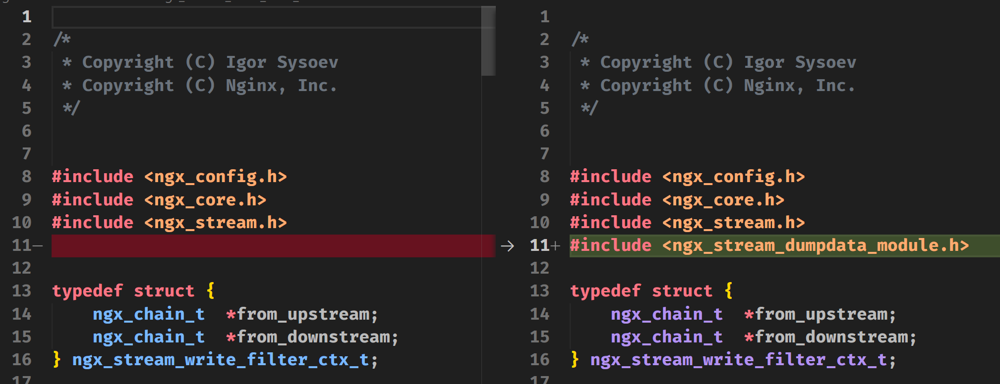
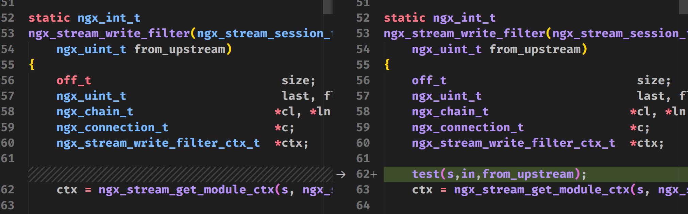
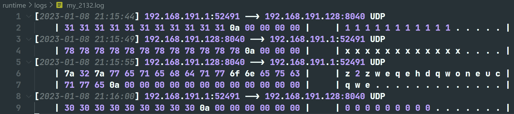

# ngx_stream_interface

此模块需要修改nginx源代码，在nginx_stream_write_filter函数中插入此模块的接口

# Install

复制此文件到`nginx/src/core/stream`中

nginx版本是`(branches/stable-1.22)`

修改`nginx/src/core/stream/ngx_stream_write_filter_module.c`文件中的`ngx_stream_write_filter`函数

修改如下

添加头文件

在`ngx_stream_write_filter`中插入test测试是否能编译成功


编译nginx

```sh
# 进入nginx项目目录中
cd ./nginx/
# 调用nginx中自定义的config生成Makefile
CFLAGS="-ggdb3 -O0" ./auto/configure \
# 各种需要的模块
# ...
--with-stream \
--with-stream_ssl_module
# 编译
make
```
编译成功后可执行文件路径在`./nginx/objs/nginx`,可以添加`make install`命令在上述指令后直接安装nginx

编译成功后实现`test`中效果代码如下

```c
void test(ngx_stream_session_t *s, ngx_chain_t *in, ngx_uint_t from_upstream)
{
	tran_t *t = new_tran_t(s->connection);
	t->sockaddr = new_cs_info_t(s->connection);
	get_data_from_nginx(s, in, from_upstream, t);
	log_info(s, t);
}
```
实现了读取nginx中stream模块交互的数据，并以log文件的形式打印出来，测试版本的`test`函数的log输出在`./runtime/logs/my_<pid>.log`中

log格式如下

```
[时间] 来源ip:来源端口 --> 目的ip:目的端口 协议
    |16进制的数据|    |ASCII形式数据|
```



# TODO

- [ ] 写一个stream模块来存储第三方接口配置信息读取
- [x] ~~如何将此模块编译进入nginx~~
- [ ] 需要一个循环体来存储第三方接口函数，并执行
- [x] ~~多进程下，log_info获取文件fd失败~~
  > 直接文件添加进程号，加锁可能导致阻塞。另外nginx.conf中添加`user root`，这样worker进程就是root权限。不会出现nobody权限的worker导致创建件权限不够的情况